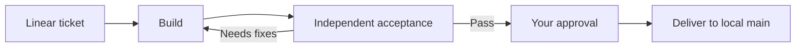

# Igniter

**A software factory for coding agents.**

Turn Linear tickets into working features, independent acceptance evidence,
and changes you approve for delivery.

Igniter gives your agents a shared workflow from request to delivery. A Global
Commander runs in your terminal, coordinates specialist agents through Herdr,
and keeps the work moving through Linear. Builders implement. Acceptance agents
test the result. Deliver agents land the approved change. You set the direction
and decide when it ships.

```bash
igniter start ENG-123
```

One ticket. A team of agents. A traceable path to delivery.

## Built for the whole job

- **Coordinated execution.** The Commander launches stage workers, supervises
  their progress, collects their reports, and drives the next step. Each ticket
  gets a Git worktree, and each worker gets its own scratch space.
- **Independent acceptance.** A separate agent exercises the feature through
  its public UI, CLI, or API. Findings come with expected behavior, actual
  results, and evidence the owner can inspect.
- **Evidence at every handoff.** Build reports include a committed checkpoint,
  check results, and a Diffwalk walkthrough. The Commander validates stage
  reports and records receipts against the checkpoint they cover.
- **The right agent for each role.** Configure Codex, Claude Code, or OpenCode
  per role, with model selection, supported reasoning effort, and a stronger
  Builder fallback for difficult work.
- **Work that can resume.** Ticket state lives in Linear. Stage recovery and
  idempotent submissions let the Commander pick up interrupted work while
  preserving the existing worktree and recorded results.
- **You own the release.** Review the evidence before approving delivery.
  Delivery lands the accepted change on local `main`; pushing and deployment
  follow your authorization and repository rules.

## The workflow



The Commander works from the project root. Build, Acceptance, and Deliver
workers work inside ticket worktrees and report back to it. The Commander
validates those reports, publishes evidence, and advances the ticket through
explicit Igniter commands.

Linear is the project board and source of truth. Herdr hosts the stage agents.
A local Bun service connects the workflow. The Commander drives the work;
the service responds to commands without polling Linear in the background.

## Get started

### Prerequisites

- Bun 1.3.11 or later on `PATH`, and Git.
- Herdr installed and running.
- The agent CLIs selected by your configuration, installed and authenticated.
  The [bundled defaults](src/commander/config.yaml) use Codex, Claude Code,
  and OpenCode.
- Diffwalk installed and ready to publish Build walkthroughs.
- A Linear project and a `LINEAR_API_KEY` supplied through your environment.

### Install

The first npm release is being prepared. Once published:

```bash
bun add --global @minipai/igniter
```

The installed command is `igniter`. It runs in Bun and includes its Commander
instructions and stage prompts.

### Connect a project

Create `.igniter/config.yaml` in the root of the Git repository you want the
agents to work on:

```yaml
project: Your Linear project
team: ENG
linear_org: your-workspace-slug
listen: 127.0.0.1:4180
max_running: 3
```

`project` accepts a Linear project name or slug; `team` accepts a team name or
key. Set `linear_org` to your own Linear workspace slug. Use a different
`listen` port for each project running on the same host.

Prepare these workflow statuses on the project's Linear team:

| Status | Linear status type |
| --- | --- |
| Backlog | Backlog |
| Todo | Unstarted |
| Build, Review, Deliver | Started |
| Done | Completed |

Create a `Progress` label group with `Pending`, `In progress`, `Complete`,
and `Blocked` child labels. Igniter validates this setup when the service starts.

Give each ticket observable acceptance criteria, for example:

```markdown
## Acceptance criteria

- [ ] Exporting the filtered table produces a CSV containing only visible rows.
- [ ] An empty result produces a CSV with headers and no data rows.
```

### Start the factory

From that project's root directory, with `LINEAR_API_KEY` in the environment:

```bash
igniter start
```

Or assign a specific ticket immediately:

```bash
igniter start ENG-123
```

`start` opens the configured Commander in the current terminal and starts the
command service in the background when needed. The prompts load from Igniter's
installation, so the same installation can serve your different projects.

Use `igniter status` for a queue overview or `igniter status ENG-123 --json`
for a ticket's current state. To supervise the service separately or inspect
startup errors, run `igniter serve` in the foreground; stop it with Ctrl-C.

After acceptance passes, review the evidence and move the ticket from Review
to Deliver to approve landing. Move Deliver to Done after confirming the final
push or deployment. The Commander reconciles those owner decisions.

## Development

From an Igniter source checkout:

```bash
bun install
bun run check
```

`bun run check` runs typechecking and Bun tests, including an isolated package
smoke test and the CLI end-to-end suite. Run the black-box suite alone with:

```bash
bun run test:e2e
```

### CLI end-to-end boundaries

The end-to-end suite starts the production dispatch HTTP service and drives it
through real CLI subprocesses. Each scenario owns a temporary Git repository,
ticket worktrees, an ephemeral port, and a whitelisted child environment. A
stateful in-memory Linear client and fake Herdr/agent processes are injected at
the service boundary. The suite never reads real credentials, contacts Linear,
starts Herdr or an LLM, changes the source checkout, or uses a fake Linear HTTP
or GraphQL endpoint. Owner status moves are direct fixture mutations only;
`submit` never pretends to merge Git.

The named scenario groups cover:

| Group | Coverage |
| --- | --- |
| Status and begin | Human and JSON status, Todo claim, unique Progress, preserved labels, live worker state, and recognizable CLI failures. |
| Lifecycle and owner gates | Build, Review PASS/FAIL, rebuild after a stale ended worker, Deliver, explicit owner approval/Done reconciliation, receipts, evidence, real Git landing, and safe cleanup. |
| Begin and concurrency | Prompt consumption, Pending start recovery, live/missing/ended workers, slot limits, duplicate claim prevention, concurrent submit dedupe, and ticket isolation. |
| Safe retries | Resubmission, failures before writes, lost write responses, failed post-write reads, attachment readback, CLI timeout with background completion, and deferred reconcile mirror/close recovery. |
| Control commands | Existing `state`, pause/resume, block/unblock, fail, builder restart override, mixed-harness `answer y/n`, stdin, workspace context, and `start` with a fake foreground Commander. |
| Refusal and Git safety | Malformed payloads, wrong stage, stale/HEAD/rebased checkpoints, owner-gate refusal, dirty/untracked/unmerged checkout retention, scratch symlink escape, and packed failure diagnostics. |

All condition polling has a deadline. On failure, the harness reports recent CLI
stdout/stderr/exit codes, in-memory Linear and Herdr calls, plus Git status,
worktrees, and branches before removing its own resources.

## License

MIT. See [LICENSE](LICENSE).
