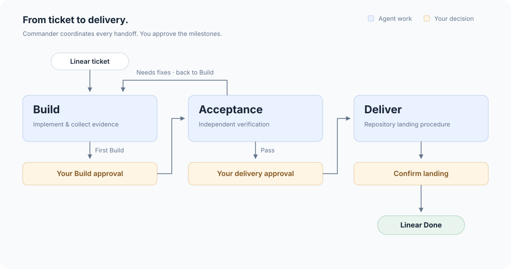

# Igniter

**A software factory for coding agents.**

Turn Linear tickets into working features with independent acceptance testing
and delivery you approve. A Commander runs in your terminal and coordinates
Build, Acceptance, and Deliver agents through Herdr.

- **Isolated work.** Each ticket gets a Git worktree and a team of agents.
- **Independent acceptance.** A separate agent tests the public UI, CLI, or API
  against your criteria without seeing the source, diff, or Build plan.
- **Your choice of agents.** Configure named Codex, Claude Code, or OpenCode
  profiles for the Commander to choose from.
- **Approval before delivery.** Review the evidence and decide when a change lands.

## The workflow



You approve the first Build and authorize delivery after Acceptance passes.
Delivery follows your repository's instructions. When Acceptance finds issues,
Build fixes them and returns directly to Acceptance. Deployment requires your
authorization.

Linear holds ticket state; Herdr hosts the agents. Igniter connects them
directly, with no background service.

## Dependencies

- **Bun 1.3.11+** — runs Igniter; must be on `PATH`.
- **Git** — isolates ticket work in worktrees.
- **Herdr** — installed and running; hosts worker agents.
- **Agent CLI** — install and authenticate the CLIs selected for your roles.
  The [defaults](src/commander/config.yaml) use Codex; you can configure
  Claude Code or OpenCode instead.
- **Linear** — a project and a `LINEAR_API_KEY` environment variable.

## Get started

### Install

```bash
bun add --global @minipai/igniter
```

### Connect a project

From your Git repository root, run:

```bash
igniter start
```

If the project is not configured, confirm the initialization prompt.
For manual setup, create `.igniter/config.yaml` in the repository root:

```yaml
project: Your Linear project
team: ENG
linear_org: your-workspace-slug
max_running: 3
```

`project` accepts a project name or slug; `team` accepts a team name or key.
Use your Linear workspace slug for `linear_org`.

Prepare these statuses on the project's Linear team:

| Status | Linear status type |
| --- | --- |
| Backlog | Backlog |
| Todo | Unstarted |
| Build, Acceptance, Deliver | Started |
| Done | Completed |
| Canceled | Canceled |

Create these child labels under a `Progress` label group:

| Label group | Child label |
| --- | --- |
| Progress | Pending |
| Progress | In progress |
| Progress | Complete |
| Progress | Blocked |

Use the status and label names exactly as shown; Igniter validates them when
a command runs.

Give each ticket observable acceptance criteria, for example:

```markdown
## Acceptance criteria

- [ ] Exporting the filtered table produces a CSV containing only visible rows.
- [ ] An empty result produces a CSV with headers and no data rows.
```

### Start

From the project root, with `LINEAR_API_KEY` set:

```bash
igniter start
```

This opens the Commander in your terminal. If it is already open from project
setup, continue in that session.

### Configure agents

Define profiles under `agents` in `.igniter/config.yaml`. Each profile selects
a `harness`, a `model`, and optionally an `effort`:

```yaml
agents:
  builder:
    model: gpt-5.6-sol
  builder_backup:
    model: gpt-5.6-luna
  specialist:
    harness: codex
    model: gpt-5.6-sol
```

Profiles with the same name merge field by field with the
[bundled defaults](src/commander/config.yaml); omitted fields are inherited.
A new profile name must specify both `harness` and `model`.

`commander` configures the Commander. `builder`, `acceptance`, and `deliverer`
are the defaults for their stages. Additional names, including the bundled
`builder_backup` and `builder_expert`, are candidates the Commander can select
with `igniter worker start ENG-123 --agent specialist`. There is no automatic
fallback or priority implied by a profile's name.

### Assign a ticket

Create a ticket in your configured Linear project with acceptance criteria,
then move it to `Todo`. In the Commander conversation, ask it to start the
ticket:

```text
Start ENG-123.
```

Replace `ENG-123` with your ticket ID. The Commander reads the ticket, prepares
a worktree, and starts the Build agent. Review its evidence when it asks for
your Build approval; after Acceptance passes, approve delivery according to
your repository's instructions.

## Documentation

- [Workflow operations](docs/workflow.md) — reports, approvals, worker recovery,
  cancellation, and command migration.
- [Project runbooks](docs/workflow.md#project-runbooks) — add repository-specific
  instructions for Build, Acceptance, and Deliver.
- [Agent defaults](src/commander/config.yaml) — harness, model, and reasoning
  settings that projects can override under `agents` in `.igniter/config.yaml`.

## Development

From a source checkout:

```bash
bun install
bun run check
```

Checks include typechecking, unit tests, and CLI end-to-end tests. Tests use
isolated fixtures, without real credentials or provider calls.

## License

MIT. See [LICENSE](LICENSE).
