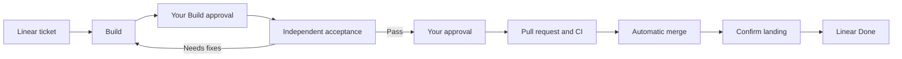

# Igniter

**A software factory for coding agents.**

Turn Linear tickets into working features, independent acceptance evidence,
and changes you approve for delivery.

Igniter gives your agents a shared workflow from request to delivery. A Global
Commander runs in your terminal, coordinates specialist agents through Herdr,
and keeps the work moving through Linear. Builders implement. Acceptance agents
test the result. Deliver agents land the approved change. You set the direction
and decide when it ships.

```bash
igniter start ENG-123
```

One ticket. A team of agents. A traceable path to delivery.

## Built for the whole job

- **Coordinated execution.** The Commander launches stage workers, supervises
  their progress, collects their reports, and drives the next step. Each ticket
  gets a Git worktree, and each worker gets its own scratch space.
- **Independent acceptance.** A separate agent exercises the feature through
  its public UI, CLI, or API. Findings come with expected behavior, actual
  results, and evidence the owner can inspect.
- **Evidence at every handoff.** Build reports include a committed checkpoint,
  check results, and the evidence required by that repository's workflow. The
  Commander validates stage reports and records receipts against the checkpoint
  they cover.
- **The right agent for each role.** Configure Codex, Claude Code, or OpenCode
  per role, with model selection, supported reasoning effort, and a stronger
  Builder fallback for difficult work.
- **Work that can resume.** Ticket state lives in Linear. Stage recovery and
  idempotent submissions let the Commander pick up interrupted work while
  preserving the existing worktree and recorded results.
- **You own the release.** Review the evidence before approving delivery.
  Delivery opens a pull request, follows CI through automatic merge, and leaves
  deployment to your authorization and repository rules.

## The workflow



The Commander works from the project root. Build, Acceptance, and Deliver
workers work inside ticket worktrees and report back to it. The Commander
validates those reports and advances the ticket through
explicit Igniter commands.

Linear is the project board and source of truth. Herdr hosts the stage agents.
The Bun CLI connects both directly; there is no background Igniter service.

## Get started

### Prerequisites

- Bun 1.3.11 or later on `PATH`, and Git.
- Herdr installed and running.
- The agent CLIs selected by your configuration, installed and authenticated.
  The [bundled defaults](src/commander/config.yaml) use Codex, Claude Code,
  and OpenCode.
- A Linear project and a `LINEAR_API_KEY` supplied through your environment.

### Install

```bash
npm install --global @minipai/igniter
```

The package is published on
[`npm`](https://www.npmjs.com/package/@minipai/igniter). The installed command
is `igniter`; it runs in Bun and includes its Commander instructions and stage
prompts.

### Connect a project

Run `igniter start` inside an unconfigured Git repository and confirm the
interactive initialization prompt. To configure it manually instead, create
`.igniter/config.yaml` in the repository root:

```yaml
project: Your Linear project
team: ENG
linear_org: your-workspace-slug
max_running: 3
```

`project` accepts a Linear project name or slug; `team` accepts a team name or
key. Set `linear_org` to your own Linear workspace slug.

Prepare these workflow statuses on the project's Linear team:

| Status | Linear status type |
| --- | --- |
| Backlog | Backlog |
| Todo | Unstarted |
| Build, Review, Deliver | Started |
| Done | Completed |

Create a `Progress` label group with `Pending`, `In progress`, `Complete`,
and `Blocked` child labels. Igniter validates this setup when a command runs.

Give each ticket observable acceptance criteria, for example:

```markdown
## Acceptance criteria

- [ ] Exporting the filtered table produces a CSV containing only visible rows.
- [ ] An empty result produces a CSV with headers and no data rows.
```

### Start the factory

From that project's root directory, with `LINEAR_API_KEY` in the environment:

```bash
igniter start
```

Or assign a specific ticket immediately:

```bash
igniter start ENG-123
```

`start` opens the configured Commander in the current terminal. Projects may replace all three
stage prompts through the `stages` map in `.igniter/config.yaml`; otherwise the
short bundled prompts apply.

```yaml
stages:
  build: { prompt: .igniter/workflow/build.md, agent: builder }
  review: { prompt: .igniter/workflow/review.md, agent: reviewer }
  deliver: { prompt: .igniter/workflow/deliver.md, agent: deliverer }
```

An override is complete: all three entries and non-empty prompt files under
the repository root are required.

Use `igniter status` for a queue overview or `igniter status ENG-123 --json`
for a ticket's current state.

Linear transitions and worker execution are separate commands. The Commander
reads `igniter status ENG-123 --json`, runs `igniter worker start ENG-123`,
confirms the initial work order was delivered, then records the stage start
with `igniter begin ENG-123`. Begin only validates and records Linear state;
it never starts a worker or sends a prompt.

`start` prepares a foreground launch and never creates a resident Herdr
Commander workspace or agent. Queue polling, automatic claim/adoption, per-ticket Commander wakeups,
and deferred mirror/wake/close retries have been removed; use explicit commands
and retry the same operation after correcting a failure.

Existing scripts should migrate these removed entry points:

| Removed entry | Replacement |
| --- | --- |
| `igniter state --json` | `igniter status <ticket> --json` |
| Bare `begin`, `submit`, `block`, `unblock` with Herdr workspace context | The same command with an explicit `<ticket>`; keep `--input -` or `--reason TEXT` |
| Background Commander start | CLI `igniter start [<ticket>]` in the calling terminal |
| `status --json` fields `lastPollAt` and per-ticket `commander` | Commands refresh state on demand; read the current stage `worker` field |
| Automatic owner-move recovery | `igniter reconcile <ticket>`, then explicit worker commands as needed |

Workers report to the Commander. The Commander validates their checkpoint,
checks, and evidence before `igniter submit ENG-123 --input -`. The first Build
waits at Build + Complete for your approval. Your explicit approval
allows `igniter approve ENG-123 --receipt <id>`, using the current receipt ID
from status, to move to Review + Pending. A PASS Review receipt similarly
permits Deliver + Pending; a valid completed Deliver receipt permits Done.
There is no `--to`: the completed stage determines the transition. Retrying
with the same receipt ID cannot approve a later stage. Ordinary sync or
continuation never grants approval. A correction Build returns automatically
to Review + Pending under the existing handoff rules.

After each approved transition, the Commander starts the next worker, confirms
delivery, and records begin. `worker start` owns worktree/scratch setup, stable
per-role identities, tabs, effective model, and confirmed initial work-order
delivery. It returns the role, model, worker identity, and result path. Use
`worker send`, `worker restart --model MODEL` (or `--profile fallback`),
`worker stop`, and `worker answer ... y|n` for worker operations. Use
`--role build|review|deliver` when targeting an earlier role or when several
workers exist. Worker commands may read ticket context but never write Linear.
A restart really replaces the selected worker and preserves existing work.

`block`/`unblock`, `fail`, and `reconcile` operate Linear without hidden worker
side effects. The Commander explicitly stops workers after handoffs and Done;
Done cleanup keeps dirty, untracked, or unmerged work and pre-existing user tabs.
An externally integrated Done still requires the Deliver report and explicit
worker cleanup. Receipt/checkpoint validation and Git safety continue to apply
at every handoff.

This repository's Deliver prompt lives at `.igniter/workflow/deliver.md`. It
rebases onto remote `main`, pushes, opens a pull request, and watches required
checks through GitHub's native auto-merge. A rebase changing only the SHA keeps
the approval; a product change needed to fix CI returns to Build and acceptance.

## Development

From an Igniter source checkout:

```bash
bun install
bun run check
```

`bun run check` runs typechecking and Bun tests, including an isolated package
smoke test and the CLI end-to-end suite. Run the black-box suite alone with:

```bash
bun run test:e2e
```

### CLI end-to-end boundaries

The end-to-end suite launches a real CLI subprocess for every command and
drives the production command protocol against a temporary Git repository and
ticket worktrees. The subprocess reaches stateful in-memory Linear and Herdr
fakes through a test-only process boundary. The suite never reads real
credentials, contacts Linear, starts Herdr or an LLM, or changes the source
checkout. Owner status moves are direct fixture mutations only;
`submit` never pretends to merge Git.

The named scenario groups cover:

| Group | Coverage |
| --- | --- |
| Status and begin | Human and JSON status, explicit worker start and Todo stage recording, unique Progress, preserved labels, live worker state, and recognizable CLI failures. |
| Lifecycle and owner gates | Build, Review PASS/FAIL, rebuild after a stale ended worker, Deliver, explicit owner approval/Done reconciliation, receipts, evidence, real Git landing, and safe cleanup. |
| Worker start | Prompt delivery, Pending start recovery, live/missing/ended workers, slot limits, duplicate begin prevention, and ticket isolation. |
| Safe retries | Resubmission, failures before writes, lost write responses, failed post-write reads, attachment readback, and explicit worker cleanup recovery. |
| Control commands | Explicit ticket status, block/unblock, fail, explicit approval, worker start/send/restart/stop, mixed-harness `worker answer y/n`, stdin, missing-ticket refusals, and `start` with a fake foreground Commander. |
| Refusal and Git safety | Malformed payloads, wrong stage, stale/HEAD/rebased checkpoints, owner-gate refusal, dirty/untracked/unmerged checkout retention, scratch symlink escape, and packed failure diagnostics. |

All condition polling has a deadline. On failure, the harness reports recent CLI
stdout/stderr/exit codes, in-memory Linear and Herdr calls, plus Git status,
worktrees, and branches before removing its own resources.

## License

MIT. See [LICENSE](LICENSE).
